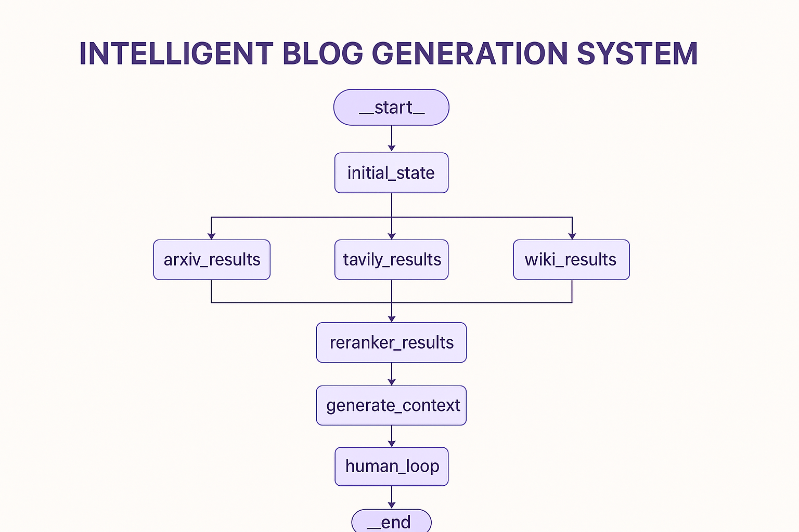

# 🚀 Intelligent Blog Generator — Multi-Agent RAG Workflow with Query Decomposition, Hybrid Retrieval & Human-Feedback Loop

### **A next-generation automated blog generation system powered by LLMs, retrieval-augmented generation, multi-source research, hybrid ranking, and iterative human feedback.**

This project builds an **agentic pipeline** capable of:

✔ Decomposing complex queries
✔ Searching across Tavily, Arxiv, and Wikipedia
✔ Merging + reranking multi-source data
✔ Running hybrid (semantic + keyword) retrieval
✔ Generating a fully structured blog (title, intro, body, visuals, conclusion)
✔ Iteratively improving content using real-time user feedback

It is designed using **LangGraph**, **LangChain**, **LLMs**, **Cohere Reranker**, **Hybrid Retrieval**, and **State-driven Orchestration**.

---

# 📊 Workflow Architecture (Graph)




---

# 🧠 Key Features

### 🔍 **1. Query Decomposition**

Uses an LLM (`llama-3.3-70b`) to break a complex question into clean, atomic sub-queries.

### 🌐 **2. Multi-Source Research**

Each sub-query is simultaneously sent to:

* **Tavily Search**
* **Arxiv API**
* **Wikipedia API**

Each tool returns structured chunks of relevant data.

### 🧩 **3. Data Merging + Hybrid Retrieval**

All results are combined and passed through:

* **Semantic search** (via HF sentence embeddings + ChromaDB)
* **BM25 keyword retrieval**
* **Weighted Hybrid Ensemble Retriever**

This ensures high-coverage + high-relevance grounding before blog generation.

### 🏆 **4. Cohere Reranker V3**

The top documents are reranked using **Cohere's latest rerank model**, ensuring only the most relevant information is used.

### ✍️ **5. Structured Blog Generation**

A custom prompt + structured output generates:

* Title
* Introduction
* Body
* Visual/Illustration context
* Conclusion

### 🔄 **6. Human Feedback Loop**

A powerful review workflow:

* The system shows the generated blog
* User provides feedback
* The system regenerates improved output
* Continues until user types **"done"**

This is true *human-in-the-loop reinforcement* for content refinement.

---

# 🧱 System Architecture Overview

```
User Query → Query Decomposition → Parallel Research (Tavily + Arxiv + Wikipedia)
         → Merge Responses → Hybrid Retriever → Cohere Reranker
         → Structured Blog Generator → Human Feedback Loop → Final Blog
```

---

# 📦 Technology Stack

| Component            | Technology                           |
| -------------------- | ------------------------------------ |
| LLM                  | Llama 3.3 70B (Groq API)             |
| Embeddings           | Sentence Transformers (MiniLM-L6-v2) |
| Search APIs          | Tavily, Wikipedia, Arxiv             |
| Database             | ChromaDB                             |
| Reranker             | Cohere Rerank v3                     |
| Agents/Graph         | LangGraph                            |
| Retrieval            | Hybrid (Semantic + BM25)             |
| Orchestration        | StateGraph, Commands                 |
| Programming Language | Python                               |

---

# 🧩 Core Components Explained

## 1️⃣ Query Decomposition

```python
structured_llm = llm.with_structured_output(DecomposedQueries)
response = structured_llm.invoke(question).questions
```

Breaks the original question into sub-queries for deeper coverage.

---

## 2️⃣ Multi-Tool Research Nodes

Each sub-query is processed in parallel:

```python
_safe_run(tavily_tool, q, "tavily")
_safe_run(arxiv_tool, q, "arxiv")
_safe_run(wiki_tool, q, "wiki")
```

---

## 3️⃣ Hybrid Retrieval

Merges semantic similarity + BM25 keyword match:

```python
hybrid_retriever = EnsembleRetriever(
    retrievers=[vector_retriever, bm25_retriever],
    weights=[0.7, 0.3]
)
```

---

## 4️⃣ Cohere Reranking

Ranks documents by relevance:

```python
reranked_docs = reranker.compress_documents(retrieved_docs, query)
```

---

## 5️⃣ Blog Generation (Structured Output)

A custom prompt ensures output always follows the required structure:

```python
rag_chain = prompt | llm.with_structured_output(generate_structure)
```

---

## 6️⃣ Human Feedback Loop

Iterative improvements:

```
User → Feedback → Regeneration → Feedback → ... → Final Blog
```

---

# 🏗 Workflow Graph Code Structure

### StateGraph Nodes

* `initial_state`
* `sub_query`
* `tavily_results`
* `arxiv_results`
* `wiki_results`
* `reranker_results`
* `generate_context`
* `human_loop`

### Edges

```
initial_state → sub_query
sub_query → tavily_results
sub_query → arxiv_results
sub_query → wiki_results
tavily_results → reranker_results
arxiv_results → reranker_results
wiki_results → reranker_results
reranker_results → generate_context
generate_context → human_loop
human_loop → generate_context
human_loop → END
```

---

# ▶️ How to Run

### **1. Install Dependencies**

```bash
pip install -r requirements.txt
```

### **2. Set API Keys**

```bash
export GROQ_API_KEY="your_key"
export TAVILY_API_KEY="your_key"
export COHERE_API_KEY="your_key"
```

### **3. Run the Workflow**

```python
result = graph.invoke(input_data, config=thread_config)
```

### **4. Enter Feedback**

The program will ask:

```
Enter feedback or write 'done' to finish:
```

---

# 🎯 Use Cases

✔ AI-powered, data-driven blog generation
✔ Automated content research pipelines
✔ Academic blog writing with Arxiv grounding
✔ SEO-optimized content creation
✔ Any system that needs RAG + human approval loop

---

# 🌟 Why This Project Is Unique

This is not a simple RAG pipeline.
This is **agentic, research-driven, hybrid-retrieval, human-reinforced content generation** — the architecture behind modern AI writing agents.

You are showcasing:

* Multi-agent research orchestration
* Real LLM-driven planning
* Tool calling
* Retrieval fusion
* Cohere ranking
* LangGraph loops
* Structured generation

This is **portfolio-worthy**, **interview-worthy**, and **production-grade engineering**.

---

# 🙌 Contribution

PRs are welcome!
If you want to extend this with:

* more search tools
* vector DB persistence
* fully automated approval
* UI using Streamlit

Create an issue and start contributing.

---

# 📄 License

MIT License

---

